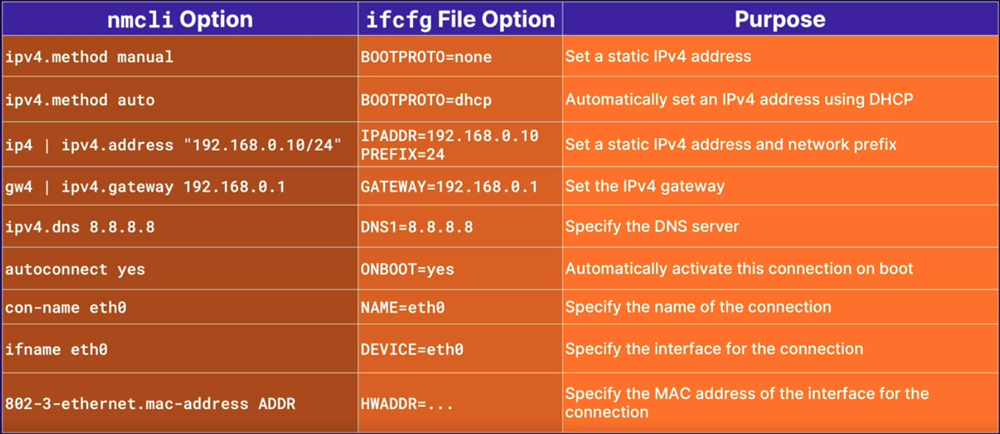

# Configuration des interfaces réseau

## Définition

- Fichier de configuration des interfaces réseau de la famille REDHAT

```
# Pour l'interface eth0
/etc/sysconfig/network-scripts/ifcfg-eth0
```

Les options notables sont : <br>
--- **BOOTPROTO=dhcp** : boot protocol (none|bootp|dhcp) (protocole de démarrage) <br>
--- **DEVICE=eth0** : nom de l'interface physique <br>
--- **HWADDR=02:be:5a...** : l'adresse MAC de l'interface <br>
--- **ONBOOT=YES** : activer l'interface au démarrage <br>
--- **TYPE=Ethernet** : type d'interface <br>
--- **IPADDR=10.0.1.10** : l'adresse IPV4 <br>
--- **PREFIX=24** : le préfixe réseau <br>
--- **NETMASK=255.255.255** : le masque reseau <br>
--- **GATEWAY=10.0.10.1** : la passerelle par défaut <br>
--- **DNS1=192.168.154.3** : le serveur DNS <br>
--- **DNS2=10.216.106.3** : autre serveur DNS <br>
--- **PEERDNS=yes** : précise s'il faudrait modifier le fichier **/etc/resolv.conf** (yes/no) <br>

- Fichier de configuration des interfaces réseau de la famille DEBIAN

```
/etc/network/interfaces
```

Les options notables sont : <br>
--- **auto eth0** : interface à afficher lorsque **ifup** est exécuté avec l'option **-a** <br>
--- **iface eth0 inet static** : ajouter des paramètres statiques <br>
--- **address 10.0.0.30** : l'adresse IPV4 <br>
--- **network 10.0.0.0** : l'adresse IPV4 réseau <br>
--- **netmask 255.255.255.0** : le masque reseau <br>
--- **broadcast 10.0.0.255** : l'adresse de diffusion <br>
--- **gateway 10.0.0.1** : la passerelle par défaut <br>
--- **dns-nameservers 10.0.0.10** : serveur DNS <br>

- Commande **nmcli**

--- **nmcli dev status** : afficher le statut de toutes les connexions <br>
--- **nmcli con show** : lister toutes les connexions actives <br>
--- **nmcli con show name** : afficher la configuration actuelle de la connexion active **name** <br>
--- **nmcli con add con-name name** : ajouter une nouvelle connexion nommée **name** <br>
--- **nmcli con mod name** : modifier une connexion <br>
--- **nmcli con up name | nmcli con down name** : activer ou désactiver une connexion <br>
--- **nmcli dev dis dev** : désactiver et déconnecter la connexion courante <br>
--- **nmcli con del name** : supprimer une connexion et son fichier de configuration <br>

- Comparaison commande **nmcli** et fichier **ifcfg** RHEL



## Pratiques

- affichons le repertoire **/etc/sysconfig/network-scripts**

```
ll /etc/sysconfig/network-scripts
```

- affichons le status des connexions d'interfaces

```
nmcli dev status
```

- affichons les connexions actives

```
nmcli con show
```

- affichons la connexion active **eth0**

```
nmcli con show eth0
```

- modifions le nom de la connexion eth0

```
sudo nmcli con mod eth0 connection.id eth1
```

- modifions le nom de l'interface eth0, sa méthode d'adressage ipv4 et son adresse ipv4

```
sudo nmcli con mod eth1 ifname eth1 ipv4.method manual ipv4.address "10.0.0.10/24"
```

Nous pouvons vérifier nos modifications en saisissant la commande :

```
ip addr
```

- désactivons la connexion d'interface eth1

```
sudo nmcli con down eth1
```

Nous pouvons vérifier que cette connexion est bien désactivée en utilisant les commandes :

```
nmcli con show
nmcli dev status
ip addr
```

- Activons notre connexion eth1

```
sudo nmcli con up eth1
```

Nous pouvons vérifier que cette connexion est bien activée en utilisant les commandes :

```
nmcli con show
nmcli dev status
ip addr
```