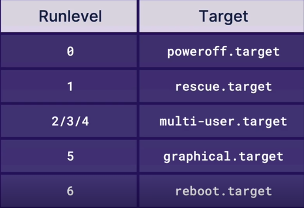

# Comprendre les niveaux d'exécution et les cibles

## Définition

- Niveaux d'exécution (Runlevels) : état d'initialisation qui détermine quels services système doivent être exécutés sur un système d'initialisation sysV. <br>
Les systèmes Linux fonctionnent ou démarrent dans un état appelé **niveau d'exécution**. Lorsque nous démarrons un système Linux, il démarre avec des conditions prédéfinies qui définissent son état. <br>
Il existe sept types de niveaux d'exécution numérotés de zéro à six. Sous Linux, les niveaux d'exécution zéro, un et six ont un objectif spécifique. Mais dans les niveaux d'exécution deux, trois et quatre, nous pouvons faire n'importe quel objectif décidé par le fournisseur de distribution. Nous pouvons passer manuellement d'un niveau d'exécution à un autre en tant qu'administrateur.

- Unité cible (target) : utilisé pour relier un groupe d'unités ensemble pour décrire un état système souhaité sur un système **systemd**.

<br>



- utiliser systemctl pour interagir avec les cibles

--- **systemctl list-units -t target** : voit les cibles chargées et actives. utilisons **--all** pour afficher également les cibles chargées et inactives. <br>
--- **systemctl get-default** : renvoie la cible par défaut. Cela renvoie le nom de l'unité cible à laquelle **default.target** est associé (lien symbolique). <br>
--- **systemctl set-default** : définit la cible par défaut. Cela définit (liens symboliques) l'alias **default.target** sur l'unité cible donnée. <br>
--- **systemctl isolate** : démarre l'unité spécifiée sur la ligne de commande et ses dépendances et arrêter toutes les autres. <br>

## Pratiques

- affichons les cibles chargées et actives 

```
systemctl list-units -t target
```

- affichons les cibles chargées, actives et inactives

```
systemctl list-units --all
```

- affichons tous les fichiers d'unité cible installés

```
systemctl list-unit-files
```

Dans cette liste affichée (via vi ou vim), nous pouvons rechercher tous les niveaux d'éxécution.

```
/runlevel
```

- affichons la cible par défaut

```
systemctl get-default
```

Nous pouvons effectivement vérifier que **default.target** est le lien symbolique de la cible par défaut.

```
ll /etc/systemd/system/default.target
```

- définissions **graphical.target** comme cible par défaut

```
sudo systemctl set-default graphical.target
```

Nous pouvons vérifier que **default.target** est désormais le lien symbolique de la nouvelle cible par défaut **graphical.target**.

```
ll /etc/systemd/system/default.target
```

- démarrons la nouvelle cible par défaut **graphical.target**

```
sudo systemctl isolate graphical.target
```

Pour vérifier si cette cible est démarrée, nous listons à nouveau l'ensemble des cibles chargées et actives

```
systemctl list-units -t target
```

- définissons à nouveau **multi-user.target** comme notre cible par défaut

```
sudo systemctl set-default multi-user.target
```

- démarrons la nouvelle cible **rescue.target**

```
sudo systemctl isolate rescue.target
```

Cela va faire tomber un tas de services et nous allons perdre notre accès au réseau. <br>
Avec cette cible (**rescue**), nous pouvons utiliser **journalctl -xb** pour afficher les journaux système, et nous pouvons également redémarrer avec **systemctl reboot**, ou nous pouvons exécuter **systemctl default** pour démarrer en mode par défaut. <br>
Nous pouvons redemarrer à nouveau notre cible **multi-user.target** :

```
sudo systemctl isolate multi-user.target
```