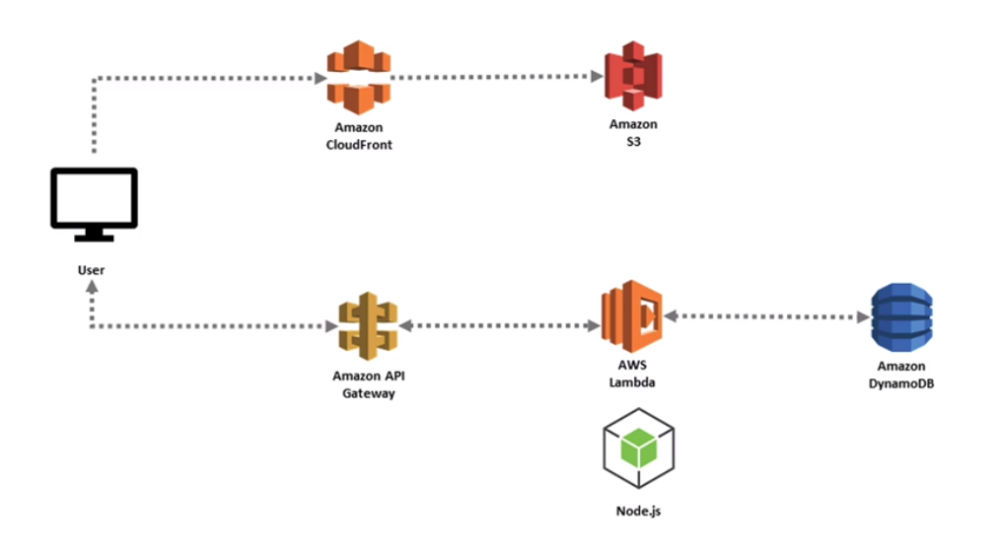

# Comprendre l'informatique sans serveur ou serverless

## Qu'est ce que l'informatique sans serveur ou serverless

- Le code est écrit pour se concentrer sur une tâche spécifique.

- Le code prend généralement la forme d'une fonction.

- Les applications/fonctions sont déclenchées par différents événements.

- Un fournisseur de cloud exécute le morceau de code en allouant dynamiquement des ressources.

- Le code s'exécute généralement dans un conteneur sans état.

- Les serveurs (ressources de calcul) sont abstraits.

- L'utilisateur n'est facturé que pour le nombre de ressources utilisées pour exécuter le code.

**Exemple d'architecture d'application web serverless sur AWS**

## comprendre les technologies et les outils du modèle serverless

- AWS Lambda

--- fournit un calcul piloté par les événements  
--- lambda peut être déclenché à partir de plus de 200 services AWS et applications SAAS  
--- prend en charge Node.js, Java, C #, Go, Powershell, Python, Ruby et l'API d'exécution pour une prise en charge supplémentaire des langages de programmation  
--- s'intègre et étend d'autres services AWS  
--- permet des services backend personnalisés, déclenchés à l'aide de l'API lambda   
--- fournit une connexion aux bases de données relationnelles et aux systèmes de fichiers partagés  

- Google cloud functions

--- fournit des fonctions serverless basées sur les événements  
--- s'intègre à d'autres services Google  
--- s'intègre à Amazon Simple Notification Service (SNS)  
--- prend en charge les langages de programmation Node.js, Python, Go, Java, .NET, Go, Ruby et PHP  
--- autres plateformes serverless fournies par Google : App Engine et Cloud Run  

- Azure functions

--- fournit un environnement événementiel  
--- s'intègre à d'autres services Azure  
--- fournit un environnement d'exécution open source  
--- prend en charge les langages de programmation C#, Javascript, F#, Java, Python, Typescript et Powershell  
--- les autres offres serverless incluent kubernetes serverless et les environnements d'application serverless  

- Knative

--- plateforme open source basée sur kubernetes  
--- utilisé pour déployer et gérer des applications serverless  
--- capable de fonctionner sur n'importe quelle distribution kubernetes - empêche le verrouillage du fournisseur  
--- les principales caractéristiques sont le service et l'événementiel  

- OpenFaaS

--- vise à simplifier le déploiement du code et des fonctions sur kubernetes  
--- utilise docker comme runtime de conteneur  
--- fonctionne sur bare-métal, VM ou cloud  
--- les microservices et les fonctions peuvent être créés dans n'importe quel langage  

- Projets utilisant des conteneurs pour le serverless

--- Azure Container instances (ACI)  
--- AWS Fargate  
--- Kubeless  
--- Fission  
--- Fn Project  
--- Virtual Kubelet