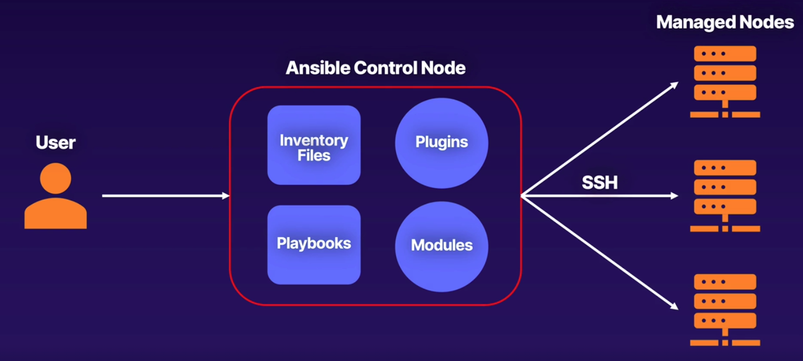
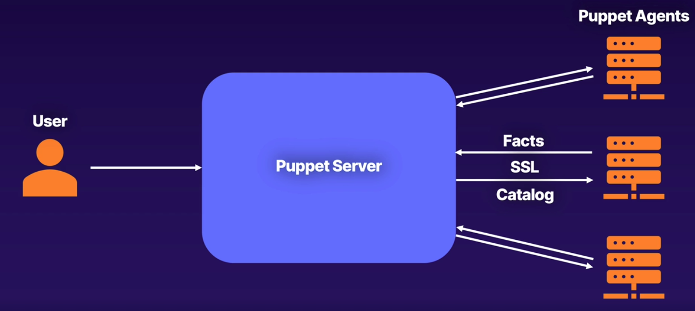
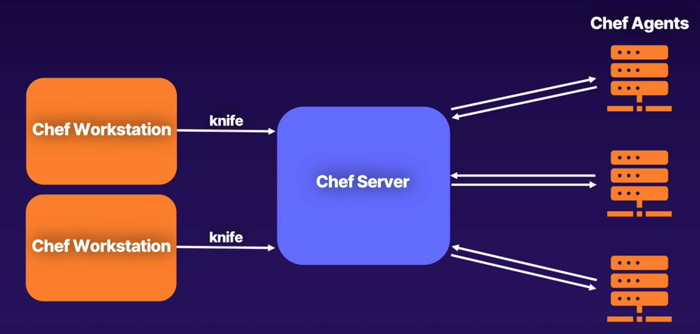
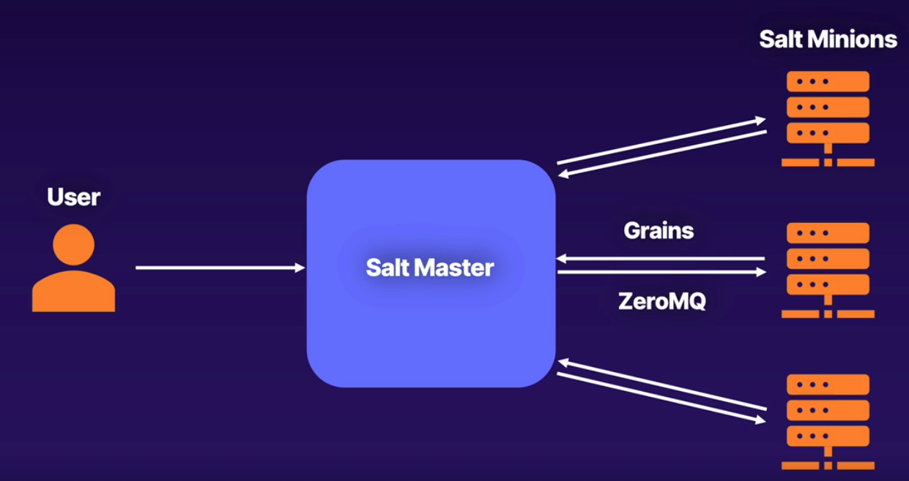

# Outils de gestion de configuration

## Aperçu de la gestion de configuration

- Répond au besoin de provisionner et de gérer de grandes quantités de système
- Introduit l'idée d'infrastructure en tant que code
- Les ressources sont définies via des fichiers de configuration
- Assure la cohérence et la réutilisabilité
- Outils communs de gestion de configuration : ansible, chef, puppet et salt

## Aperçu d'Ansible

- Utilise un seul nœud de gestion
- Implémente une architecture sans agent
- Les mises à jour et la communication se font en toute sécurité via ssh
- Les nœuds sont spécifiés via des fichiers d'inventaire
- La configuration, le déploiement et l'orchestration sont spécifiés via des playbooks
- Les modules ansibles sont des unités de code discrètes qui peuvent être utilisées dans les playbooks ou à partir de la ligne de commande

## Aperçu de Puppet

- Implémente un modèle client-serveur
- Un ou plusieurs serveurs exécutent le serveur Puppet
- Les nœuds gérés exécutent l'agent Puppet
- Les agents envoient des informations système (faits) au serveur
- Le serveur Puppet compile un fichier catalogue sur la base des informations système et du fichier manifeste
- Le fichier manifeste est créé à l'aide du code Puppet et peut avoir une ou plusieurs sections
- L'agent Puppet reçoit des instructions opérationnelles du fichier catalogue

## Aperçu de Chef

- Implémente un modèle client-serveur
- Le client est connu sous le nom de **client chef**
- Le serveur de gestion est connu sous le nom de **serveur chef**
- Fournit le **chef workstation**
- Le **chef workstation** est utilisé pour développer des cookbooks et des recettes, configurer des politiques et des rôles, etc.
- Le **chef workstation** définit un scénario et contient des recettes et des attributs pour le prendre en charge
- **knife** fournit une interface entre un référentiel chef local et le serveur chef

## Aperçu de Salt

- Fournit à la fois des modèles client-serveur et sans agent
- Pour le modèle sans agent, la communication passe par ssh
- Pour le modèle client-serveur, les commandes et les configurations sont envoyées de manière parallèle
- Un client géré est appelé un **salt-minion**
- Les **salt-minion** reçoivent des commandes de configuration du **salt-master** et rendent compte
- Le **salt-master** est le serveur de gestion central
- Dans une configuration par défaut, la communication entre le **salt-master** et les **salt-minion** se produit sur **zeroMQ**
- Les informations recueillies auprès des **salt-minion** sont appelées **grain**

